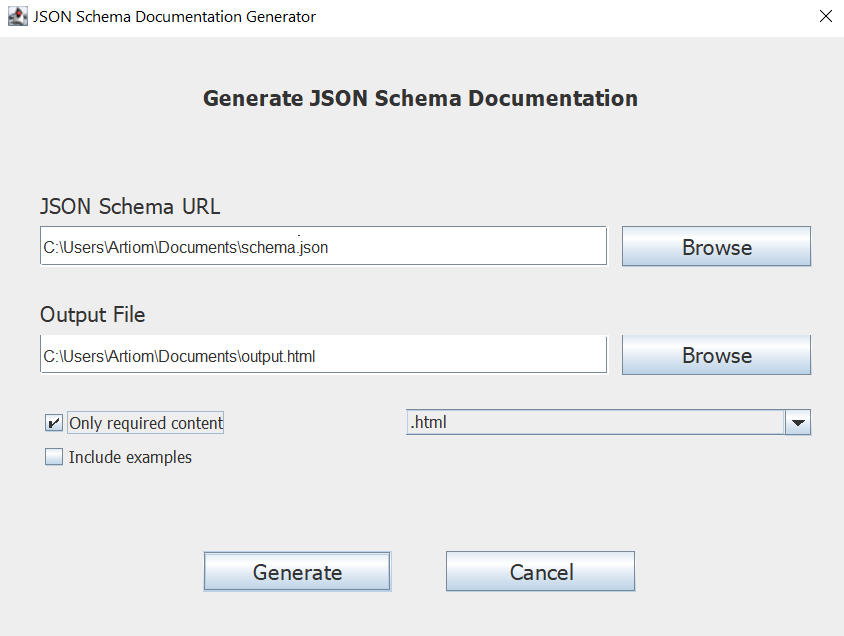

<h1 align="center"><strong><em>JSON Schema Documentation Generator</strong></em></h1>

  
# How to run the app?

To run this application: 
 

* You have to have Java installed. You can download it here: <a href="https://www.java.com/en/">Link</a>
* After that accees the <a href="https://github.com/Yashmerino/J-S-D-G/releases">Releases</a> section and download the last version of the application.
* Right-click the zipped folder saved to your computer and choose "Extract All". Run the application and enjoy!

<h1 align="center"><strong>Demonstration</strong></h1>

